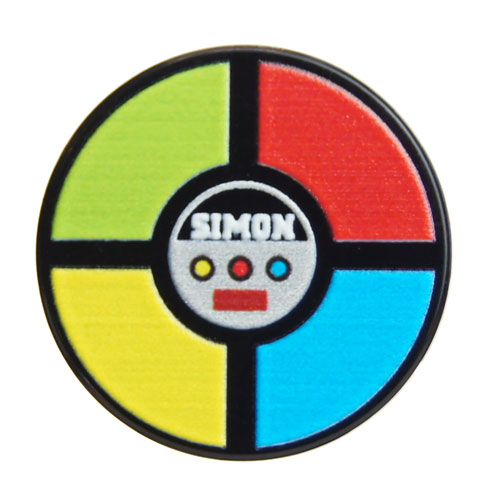

# Simon Says

## What is Simon Says?

Simon Says is a memory game, with 4 colors (red, yellow, green, and blue). One of the colors will light up, and the user must 
click the button with the same color. The game will continue, and the user will have to continuously click the right buttons with the 
same color combination that has been created. The game will end once the user does not create the correct combination. I chose to use this
game because I started to think of the logic, and how the game would work and it was something that made sense to me. I also think it would
be fun to design it and there's a lot I can do!

## Technical Discussion

HTML, CSS, Javascript

### Notes on Game Structure

> Code samples, description of challenges you overcame, etc.

## The Making of [Your Game]

> Any credits or notes you feel you should add

## Opportunities for Future Growth

> If you had more time to work on your game, what would you do?
